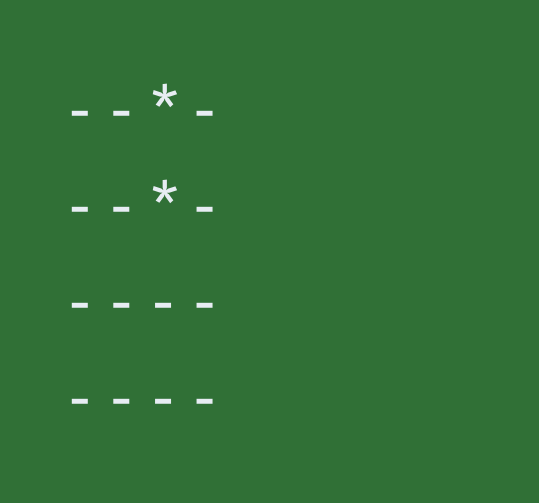

# CLI Minesweeper-2030

In this warm up programming assignment you will practice test driven development (using jUnit) in addition to object 
modeling and capturing the design of your program using UML class diagrams.

You will be implementing a basic command-line-interface (CLI) minesweeper game. This is a single player game that's played on NxN grid, where some number of squares have an `X` denoting the position of a mine. On every turn, the player selects a square on the grid and one of two things should happen:
* if the square the player selected is a mine, they lose immediately
* if the square the player selected is not a mine and at least one of the squares adjacent to it (including diagonally) is a mine, the square reveals the number of adjacent mines. This number remains displayed in that grid square until the end of the game.

The player wins when they have revealed all squares that are **not** mines.

## Step 1: object modeling

Come up with a data structure to store the state of the game (the board).

Create a 4x4 board and place mines in the first two places in third column.

Have the ability to render the board in string form. In the string, 
represent an empty square with a dash `-` and a mine with a `*`. 
Your output should look like the image shown.

A good initial unit test would be to ensure that your board rendering logic is working 
before proceeding.

## Step 2: revealing squares

Now create a function to reveal a square on the board. 

This function should take two inputs, a row and a column, and reveal the
selected square using the rules of Minesweeper:
- **if the selection is mine**, print the board followed by the text "you lose".
- **if the selection is not a mine**, change that square to display the number of 
mines adjacent to it (including diagonally).

Test your function by revealing some number of squares. The picture below has revealed
the first, third, and fourth squares in the second column (your output should 
look like the image shown)

## Step 3: user input

Now make it such that your game can take user input (from the `Scanner`).

Prompt the user to enter a (1-indexed) row and column, separated by a comma
(e.g., `2,3` for the second row and third column).

If the user's input is invalid, prompt them for a new one.

Otherwise, reveal the square using the function from the previous step, print the board,
and either tell the player they lost or prompt them for another input.

Here's a useful test case that makes the following selections:
* 1,1
* 2,4
* 2,3

Your tests (among other that you think up) should check that 
your board matches the picture below:

## Step 4: adding a win check

After a player's move, check whether every square that is *not* a 
mine has been revealed. If so, print "you win" after the player's
move and do not prompt them for another move.

Write additional tests that cover the board with mines except two 
squares `(2,3)` and `(1,1)`, then select those two squares by entering
`2,3` and `1,1`. Your board should match the image.

## Step 5: reveal

When a player reveals

